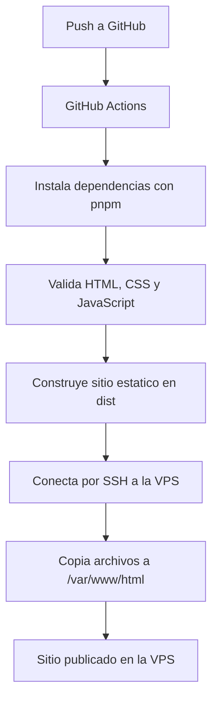

# Workflow CI/CD hacia VPS

Mini aplicacion web estatica para demostrar un flujo basico de CI/CD con GitHub Actions. Cada push a la rama principal valida el proyecto, construye el sitio en `dist/` y lo despliega automaticamente hacia una VPS por SSH.

## Arquitectura basica

| Archivo | Funcion |
| --- | --- |
| `test/static-site.test.ts` | Validaciones automaticas del contenido y estructura. |
| `.github/workflows/deploy.yml` | Pipeline de CI/CD. |

## Que hace el pipeline

El workflow se ejecuta con cada push a `main` o `master`:

## Como se despliega hacia la VPS

El despliegue usa dos acciones:

- `appleboy/ssh-action`: prepara el directorio remoto y valida el resultado.
- `appleboy/scp-action`: copia el contenido de `dist/` hacia `${{ secrets.VPS_PATH }}`.

