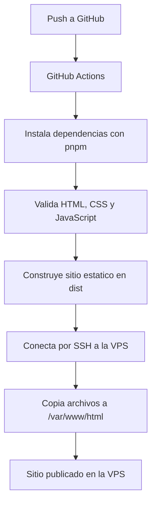

# Workflow CI/CD hacia VPS

Mini aplicacion web estatica para demostrar un flujo basico de CI/CD con GitHub Actions. Cada push a la rama principal valida el proyecto, construye el sitio en `dist/` y lo despliega automaticamente hacia una VPS por SSH.

## Arquitectura basica



La aplicacion vive en `src/`:

| Archivo | Funcion |
| --- | --- |
| `src/index.html` | Home page principal del sitio estatico. |
| `src/styles.css` | Estilos responsivos de la pagina. |
| `src/script.js` | JavaScript basico para mostrar estado de carga. |
| `test/static-site.test.ts` | Validaciones automaticas del contenido y estructura. |
| `.github/workflows/deploy.yml` | Pipeline de CI/CD. |

## Que hace el pipeline

El workflow se ejecuta con cada push a `main` o `master`:

1. Descarga el repositorio.
2. Prepara Node.js 24 y pnpm.
3. Instala dependencias con `pnpm install --frozen-lockfile`.
4. Ejecuta validaciones con `pnpm validate`.
5. Construye el sitio estatico con `pnpm build`.
6. Sube `dist/` como artefacto de GitHub Actions.
7. Crea y limpia el directorio destino en la VPS.
8. Copia los archivos estaticos hacia la VPS.
9. Verifica que `index.html`, `styles.css` y `script.js` existan en el servidor.

## Secrets requeridos en GitHub Actions

Configura estos secrets en GitHub:

| Secret | Valor sugerido | Descripcion |
| --- | --- | --- |
| `VPS_HOST` | `72.61.7.158` | IP publica de la VPS. |
| `VPS_USER` | `root` | Usuario SSH usado por el workflow. |
| `VPS_SSH_KEY` | clave privada SSH | Llave privada autorizada en la VPS. |
| `VPS_PATH` | `/var/www/html` | Ruta donde se publicara el sitio. |

No coloques passwords ni claves privadas dentro del workflow. La llave publica correspondiente a `VPS_SSH_KEY` debe estar en `~/.ssh/authorized_keys` del usuario configurado en `VPS_USER`.

## Como se despliega hacia la VPS

El despliegue usa dos acciones:

- `appleboy/ssh-action`: prepara el directorio remoto y valida el resultado.
- `appleboy/scp-action`: copia el contenido de `dist/` hacia `${{ secrets.VPS_PATH }}`.

La ruta esperada para esta entrega es:

```bash
/var/www/html
```

Si la VPS usa Nginx o Apache sirviendo esa carpeta, el sitio queda disponible por HTTP despues de un pipeline exitoso.

## Como comprobar que funciona

En GitHub:

1. Haz push a la rama principal.
2. Abre la pestana **Actions** del repositorio.
3. Entra al workflow **Deploy static site to VPS**.
4. Confirma que los pasos `Validate static app`, `Build static site`, `Copy static site to VPS` y `Verify deployed site` aparecen en verde.

Desde una terminal o navegador:

```bash
curl http://72.61.7.158/
```

Tambien puedes abrir:

```text
http://72.61.7.158/
```

## Desarrollo local

Instala dependencias y ejecuta las validaciones:

```bash
pnpm install
pnpm validate
pnpm build
```

Para revisar el resultado construido, abre `dist/index.html` en el navegador despues de ejecutar `pnpm build`.
